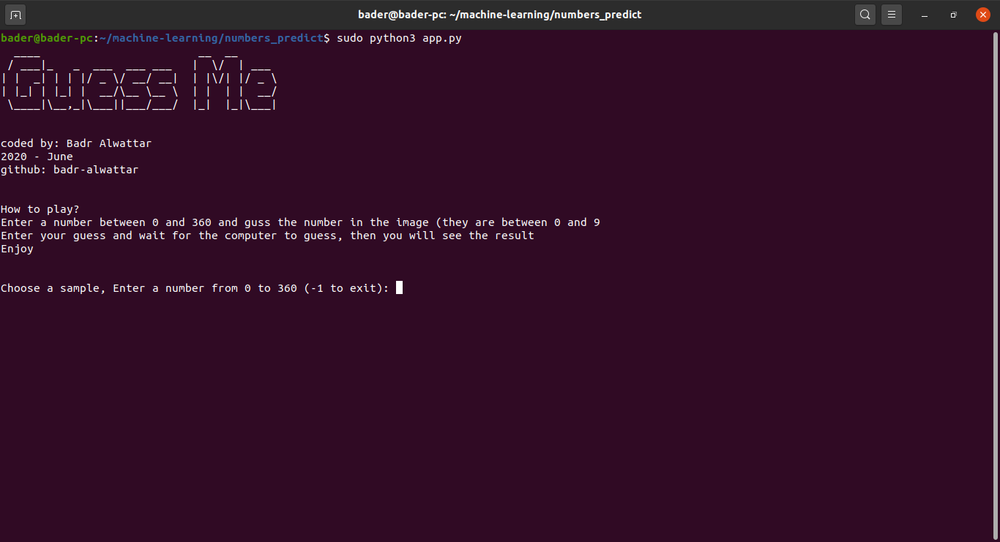
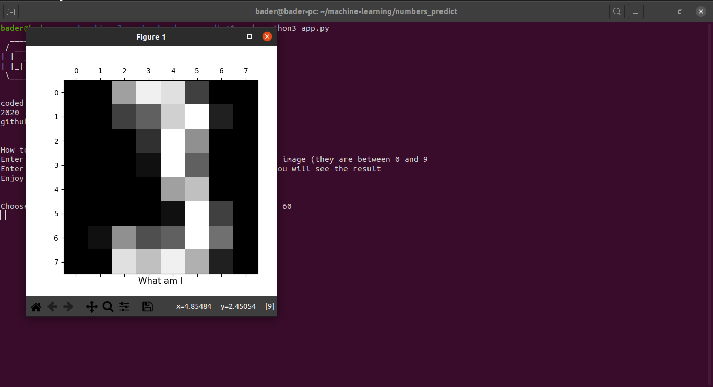
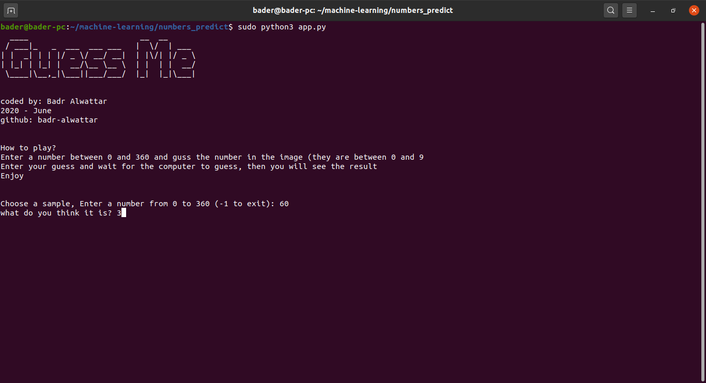
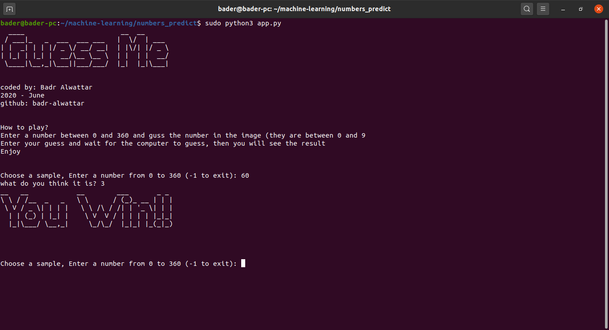
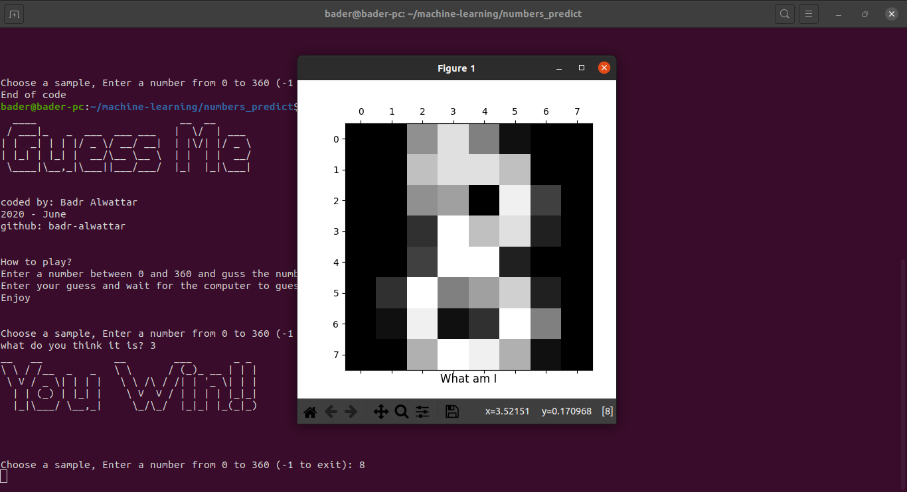
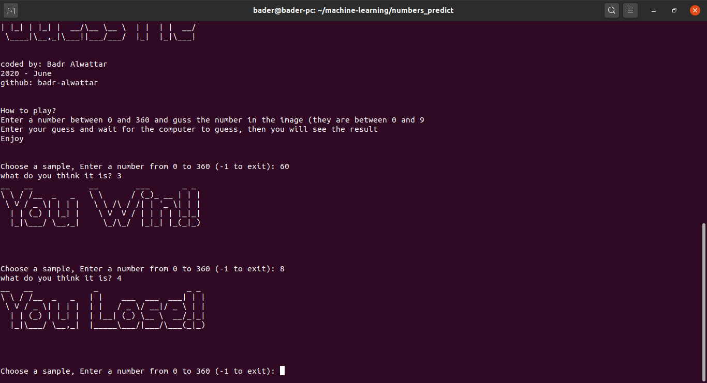
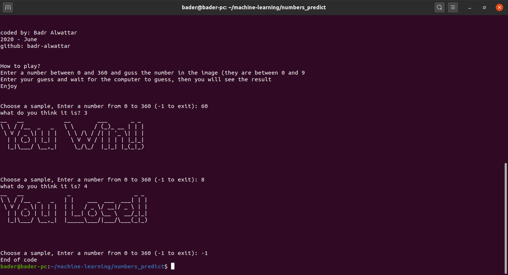

> about the game

This is a simple game that you can play it in your terminal, you will chose a random number and a picture will pop up, guss the number in the figure to win the round

>Screen Shots:

##### After executing the python code

##### Choose 60 as a random number

##### Any gusses?

##### I guess it is 3

##### Correct!!

##### Choose 60 as a random number, Any guesses?

##### I lost! :(

##### -1 to exit

> getting started
1) You must have python 3 installed
2) `pip install matplotlib`
3) `pip install sklearn`
4) `pip install pyfiglet`
5) run `app.py`

